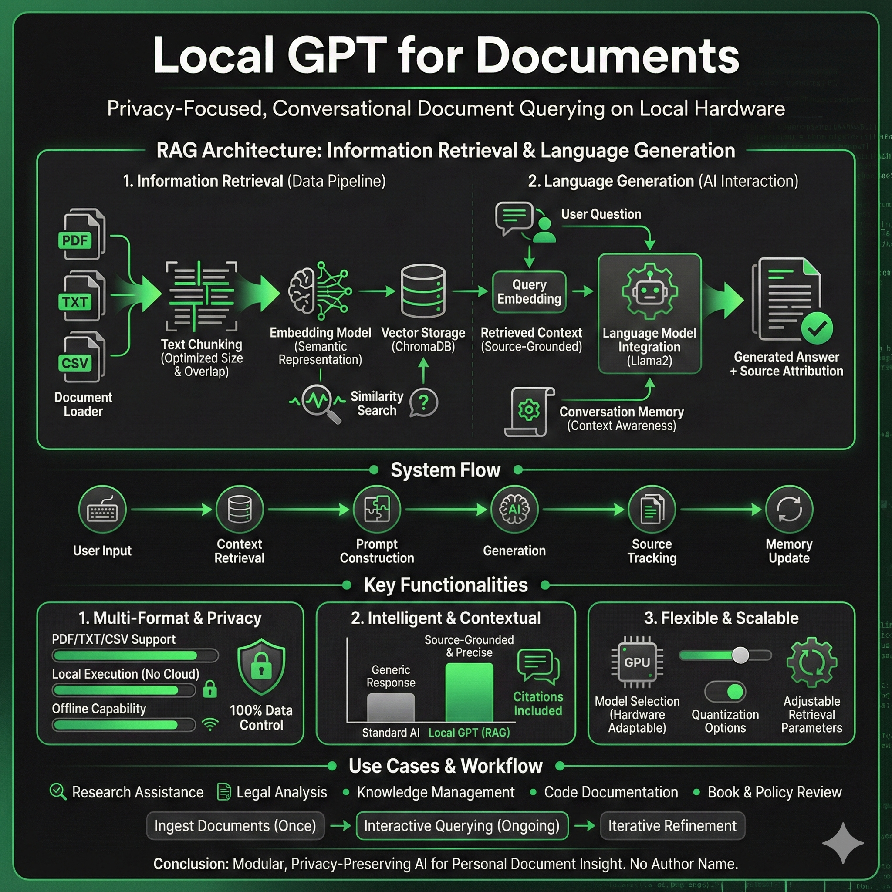

# MyLocalGPT

A privacy-focused implementation of GPT leveraging Llama2 for local document querying. Query your own documents using language models running entirely on your local device.



## Features

- **Complete Privacy**: All processing happens locally
- **Multiple Document Formats**: PDF, TXT, and CSV support
- **Flexible Model Selection**: Various Llama2 models based on hardware
- **Conversation Memory**: Maintains context across queries
- **Source Attribution**: Answers include document references
- **Multi-Device Support**: CPU, CUDA, or MPS (Apple Silicon)

## Architecture

MyLocalGPT uses a RAG (Retrieval-Augmented Generation) pipeline:

1. Documents are loaded and split into chunks
2. Text chunks are converted to vector embeddings
3. Embeddings are stored in ChromaDB
4. User queries are matched against stored vectors
5. Retrieved context is fed to Llama2 for answers
6. Source documents are tracked and displayed

## Prerequisites

- Python 3.8+
- 8GB RAM minimum (16GB+ recommended)
- Optional GPU: NVIDIA (8GB+ VRAM) or Apple Silicon
- 10GB+ disk space

## Installation

```bash
# Clone repository
git clone <repository-url>
cd MyLocalGPT

# Create virtual environment
python -m venv venv
source venv/bin/activate  # Windows: venv\Scripts\activate

# Install dependencies
pip install -r requirements.txt
```

Models download automatically on first run (~4GB for default Llama-2-7B).

## Configuration

Edit `constants.py` to configure:

### Device Type
```python
DEVICE_TYPE = "mps"    # Apple Silicon
# DEVICE_TYPE = "cuda"  # NVIDIA GPU
# DEVICE_TYPE = "cpu"   # CPU only
```

### Model Selection
```python
# Default: Llama2 7B (4GB, good balance)
MODEL_ID = "TheBloke/Llama-2-7B-Chat-GGML"
MODEL_BASENAME = "llama-2-7b-chat.ggmlv3.q4_0.bin"
```

### Embedding Model
```python
# Default (recommended)
EMBEDDING_MODEL_NAME = "hkunlp/instructor-large"  # 1.5GB VRAM

# Alternatives:
# "all-MiniLM-L6-v2"  # 0.2GB VRAM (faster, less accurate)
# "intfloat/e5-base-v2"  # 0.5GB VRAM (good balance)
```

## Usage

### 1. Add Documents
```bash
mkdir SOURCE_DOCUMENTS
# Place your PDF, TXT, or CSV files here
```

### 2. Ingest Documents
```bash
python ingest.py
```

This processes documents and creates embeddings in the `DB` folder.

### 3. Query Documents
```bash
python run_localGPT.py
```

Or use the enhanced version:
```bash
python run_localGPT2.py
```

**Difference**: `run_localGPT2.py` supports GGUF and GPTQ formats with more model loading options.

### 4. Ask Questions
```
Enter a query: What is a Large Language Model?
```

Type `exit` to quit.

## Supported Documents

| Format | Notes |
|--------|-------|
| `.pdf` | Text extraction from PDFs |
| `.txt` | UTF-8 encoded text files |
| `.csv` | Comma-separated values |

Extend support by modifying `load_single_document()` in `ingest.py` using [LangChain loaders](https://python.langchain.com/docs/modules/data_connection/document_loaders/).

## Model Options

### GGML/GGUF (CPU/MPS)
```python
# 7B - Recommended for most users
MODEL_ID = "TheBloke/Llama-2-7B-Chat-GGML"
MODEL_BASENAME = "llama-2-7b-chat.ggmlv3.q4_0.bin"

# 13B - Better quality, more resources
MODEL_ID = "TheBloke/Llama-2-13b-Chat-GGUF"
MODEL_BASENAME = "llama-2-13b-chat.Q4_K_M.gguf"
```

### GPTQ (CUDA Only)
```python
# For 8-10GB VRAM GPUs
MODEL_ID = "TheBloke/Wizard-Vicuna-7B-Uncensored-GPTQ"
MODEL_BASENAME = "Wizard-Vicuna-7B-Uncensored-GPTQ-4bit-128g.no-act.order.safetensors"

# For 24GB VRAM GPUs
MODEL_ID = "TheBloke/Wizard-Vicuna-13B-Uncensored-GPTQ"
MODEL_BASENAME = "Wizard-Vicuna-13B-Uncensored-GPTQ-4bit-128g.compat.no-act-order.safetensors"
```

See `constants.py` for more model options.

## Troubleshooting

**Out of Memory**
- Use smaller model (7B instead of 13B)
- Use smaller embedding model (`all-MiniLM-L6-v2`)
- Reduce `max_tokens` and `n_ctx` in code

**Model Download Issues**
- Check internet connection
- Verify model ID on HuggingFace
- Models cache in `~/.cache/huggingface/`

**Slow on CPU**
- Use quantized GGML models (already default)
- Reduce document chunk size
- Use smaller embedding model

**ChromaDB Errors**
- Delete `DB` folder and re-run `python ingest.py`

## Sample Output

```
> Question:
What is a Large Language Model?

> Answer:
A large language model refers to a type of artificial intelligence (AI) model 
designed to process and generate human-like text, typically using deep learning 
techniques such as transformers. These models are trained on vast amounts of text 
data and can perform tasks like translation, summarization, and text generation. 
The term "large" refers to the model's size in parameters (millions or billions), 
which affects its performance and capabilities.

----------------------------------SOURCE DOCUMENTS---------------------------
> /Users/.../SOURCE_DOCUMENTS/GPT-3-Language Models are Few-Shot Learners.pdf:
We presented a 175 billion parameter language model which shows strong 
performance on many NLP tasks and benchmarks...
----------------------------------SOURCE DOCUMENTS---------------------------
```

## Project Structure

```
MyLocalGPT/
├── constants.py           # Configuration
├── ingest.py             # Document processing
├── run_localGPT.py       # Simple query interface
├── run_localGPT2.py      # Enhanced query interface
├── requirements.txt      # Dependencies
├── SOURCE_DOCUMENTS/     # Your documents (gitignored)
└── DB/                   # Vector database (gitignored)
```

## Contributing

Contributions welcome! Please:
- Report bugs via issues
- Submit PRs for improvements
- Share feedback and use cases

## License

MIT License

## Author

**Sampad Kar**
- GitHub: [@sampadk04](https://github.com/sampadk04)

---

Built with [LangChain](https://www.langchain.com/), [Llama2](https://ai.meta.com/llama/), and [ChromaDB](https://www.trychroma.com/)
